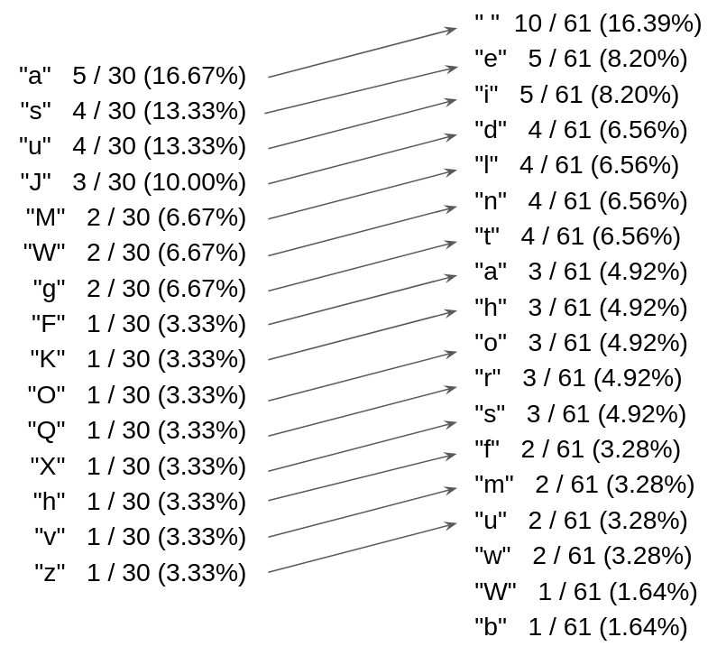

Frequency analysis is a technique used to decrypt messages that have been encoded using simple letter substitutions. For example, in an attempt to send a secret email to a friend, you might substitute each letter for another using a pre-defined letter mapping schema. Perhaps "a" becomes "p", "b" becomes z", "c" becomes "r", "d" becomes "e" and so forth. The resulting message can be decoded so long as two different letters are not mapped to the same substitute.

Messages encrypted this way can be cracked because every language uses some letters more frequently than others. For example, in most English texts, the letter "e" represents about 12% of all letter. This can allow an eavesdropper to deduce the letter mapping schema and decode the encrypted text.

The typical frequency of each character can be evaluated using sample text from the target language. For example, the following English sample string "with four hundred miles of trail still between him and dawson" can be used to calculate the following character frequency distribution:

```
" "  10 / 61 (16.39%)
"e"   5 / 61 (8.20%)
"i"   5 / 61 (8.20%)
"d"   4 / 61 (6.56%)
"l"   4 / 61 (6.56%)
"n"   4 / 61 (6.56%)
"t"   4 / 61 (6.56%)
"a"   3 / 61 (4.92%)
"h"   3 / 61 (4.92%)
"o"   3 / 61 (4.92%)
"r"   3 / 61 (4.92%)
"s"   3 / 61 (4.92%)
"f"   2 / 61 (3.28%)
"m"   2 / 61 (3.28%)
"u"   2 / 61 (3.28%)
"w"   2 / 61 (3.28%)
"W"   1 / 61 (1.64%)
"b"   1 / 61 (1.64%)
```

Such a distribution can be used to enable decryption of text encoded using a secret substitution schema assuming it was originally in the same language. This is achieved by analyzing the encoded text's character frequency distribution and finding the closest matches from the sample's distribution. 

For example, the following encoded text string "QMuagMsJgFavsKuaJsXuJaWhzaWsOu", can be used to calculate the following character frequency distribution:
```
"a"   5 / 30 (16.67%)
"s"   4 / 30 (13.33%)
"u"   4 / 30 (13.33%)
"J"   3 / 30 (10.00%)
"M"   2 / 30 (6.67%)
"W"   2 / 30 (6.67%)
"g"   2 / 30 (6.67%)
"F"   1 / 30 (3.33%)
"K"   1 / 30 (3.33%)
"O"   1 / 30 (3.33%)
"Q"   1 / 30 (3.33%)
"X"   1 / 30 (3.33%)
"h"   1 / 30 (3.33%)
"v"   1 / 30 (3.33%)
"z"   1 / 30 (3.33%)
```

For short texts, exact matches will be rare. The matching should be done as follows: characters from the encoded text's distribution should be sorted in decreasing order of frequency. In the case where two letters have the same frequency, they should be subsorted in increase order using their Unicode numeric value (quasi-alphabetical).  The same should be done with characters from the sample text's distribution. The above examples are sorted this way. Characters from the encoded text's distribution should then be matched one at a time start from the top of the list to the closest available candidate from the sample list. Characters should match 1-to-1. In the example case, the mapping would be as follows:



We can then use the mapping to decrypt the encoded string. For the above case, "QMuagMsJgFavsKuaJsXuJaWhzaWsOu" becomes "rli tledta mehi desid nfu neoi". Decryption accuracy will improve as the sample size and encoded text size grow.

Write a function

```
    function solution(S,E);
```
that, given a Unicode string **S** of length **M** representing sample text in an unknown language and a Unicode string **E** of length **N** representing text encoded using a simple substitution, returns a Unicode string representing the decoded text as defined using the above rules.

Write an efficient algorithm for the following assumptions:

  * S and E are Unicode strings composed of characters from the UTF-16 range (0 to 65535).
  * M is an integer within the range [0..100,000].
  * N is an integer within the range [0..100,000].
  * S will always contain more distinct characters than E.
  * Substitution mappings are unique. i.e. Multiple different letters are never mapped the same substitute.
